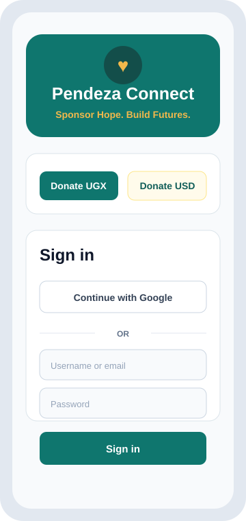
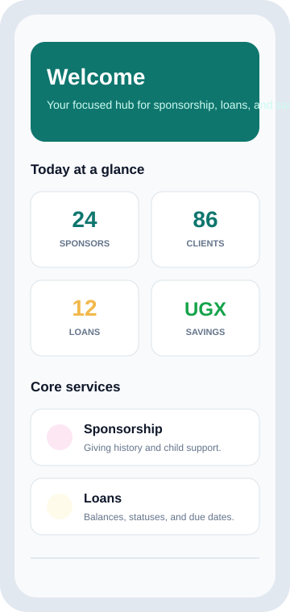
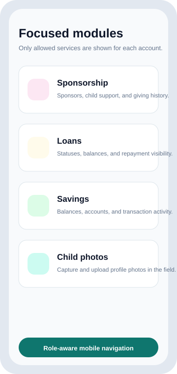

# Pendeza Connect Mobile

Pendeza Connect Mobile is the React Native companion app for Pendeza Connect. It gives staff, sponsors, and clients a focused mobile workspace for sponsorship, loans, savings, payments, profile management, and field photo capture.

## Screenshots

| Sign in | Dashboard | Services |
| --- | --- | --- |
|  |  |  |

## Highlights

- Role-aware home dashboard for staff, sponsors, and clients.
- Google sign-in through a native Android development build.
- Secure JWT storage with automatic token refresh.
- Sponsorship, loans, savings, payments, clients, sponsors, staff, and child-photo workflows.
- Staff-only child profile photo capture and upload.
- Mobile-first navigation with Home, Services, and Account tabs.
- Configurable API base URL for emulator, physical device, and production environments.

## Tech Stack

- Expo SDK 54
- React Native 0.81
- Expo Router
- TypeScript
- Axios
- Expo SecureStore
- React Native Google Sign-In

## Requirements

- Node.js and npm
- Android Studio with SDK Platform 36, Build Tools, Platform Tools, and Command-line Tools
- A running Pendeza Connect backend API
- Firebase Android config at `google-services.json` for native Google sign-in

## Environment

Create `.env` from `.env.example` and update values for your machine:

```env
EXPO_PUBLIC_API_BASE_URL=http://127.0.0.1:8000/api/v1
EXPO_PUBLIC_API_TIMEOUT_MS=15000
EXPO_PUBLIC_APP_ENV=development

EXPO_PUBLIC_GOOGLE_WEB_CLIENT_ID=
EXPO_PUBLIC_GOOGLE_ANDROID_CLIENT_ID=
EXPO_PUBLIC_GOOGLE_IOS_CLIENT_ID=
```

For a physical Android phone on the same network as the backend, use your computer LAN IP:

```env
EXPO_PUBLIC_API_BASE_URL=http://YOUR_PC_IP:8000/api/v1
```

For an Android emulator:

```env
EXPO_PUBLIC_API_BASE_URL=http://10.0.2.2:8000/api/v1
```

## Google Sign-In

Native Google sign-in requires a development build. Expo Go is not supported for this flow because Google blocks `exp://` redirect URIs.

Firebase setup:

- Android package name: `org.pendeza.connect`
- Add the debug SHA-1 fingerprint used by the local Android build.
- Download the Firebase Android config and save it as `google-services.json` in the project root.
- Set `EXPO_PUBLIC_GOOGLE_WEB_CLIENT_ID` and `EXPO_PUBLIC_GOOGLE_ANDROID_CLIENT_ID` in `.env`.

The backend must accept the same Google client/project used by the mobile app.

## Running the App

Install dependencies:

```powershell
npm install
```

Start the Android development build:

```powershell
npm run mobile
```

Start Expo for web or non-native development:

```powershell
npm start
npm run web
```

Run type checks:

```powershell
npm run typecheck
```

## Scripts

| Command | Purpose |
| --- | --- |
| `npm run mobile` | Builds and opens the Android development app on port 8082. |
| `npm start` | Starts Expo Metro for general development. |
| `npm run android` | Runs the default Android build command. |
| `npm run web` | Starts the web build. |
| `npm run typecheck` | Runs TypeScript checks. |
| `npm run lint` | Runs ESLint. |

## Project Structure

```text
app/                  Expo Router screens and tab navigation
src/api/              API client and resource services
src/components/       Shared UI components
src/features/         Dashboard, services, loans, savings, payments, and field workflows
src/providers/        Authentication provider
src/utils/            Formatting, role, storage, and route helpers
assets/               App icon, logo, and splash assets
docs/screenshots/     README screen previews
```

## Notes

- `google-services.json` contains local Firebase configuration and should be managed carefully.
- If Android closes immediately, inspect `adb logcat` for native dependency mismatches.
- If Google sign-in returns `DEVELOPER_ERROR`, verify the Android OAuth client package name and SHA-1 fingerprint in Firebase or Google Cloud.
